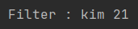
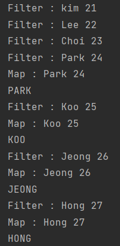

# Stream

### Stream이란?

💡 데이터 처리 연산을 지원하도록 컬렉션 또는 배열에서 추출된 요소

* 람다식으로 요소 처리코드를 제공한다.
* 내부 반복자를 사용하므로 병렬 처리가 쉽다.
  * 반복은 컬렉션 내부에서 일어난다.
* 중간 연산과 최종 연산이 존재한다.
  * 최종 연산이 시작될 때까지 중간 연산은 지연된다.

### Stream 연산

* 스트림 인터페이스 연산은 크게 두가지(중간 연산, 최종 연산)로 구분할 수 있다.

#### (1) 중간연산

* 연산결과를 스트림으로 반환하기 때문에 중간 연산을 연속해서 연결할 수 있다.
* 중간 연산의 중요한 특징은 단말 연산을 스트림 파이프라인에 실행하기 전까지는 아무 연산도 수행하지 않는다.

| 연산       | 연산의 인          | 함수 디스크립     |
| -------- | -------------- | ----------- |
| filter   | Predicate\<T>  | T → boolean |
| map      | Function\<T,R> | T → R       |
| limit    |                |             |
| sorted   | Conparator\<T> | (T,T) → int |
| distinct |                |             |

#### (2) 최종 연산

* 스트림의 요소를 소모하면서 연산을 수행하기 때문에 단 한번만 연산이 가능하다.

| 연산      | 목적                                     |
| ------- | -------------------------------------- |
| forEach | 스트림의 각 요소를 소비하면서 람다를 적용한다. void를 반환한다. |
| count   | 스트림의 요소 개수를 반복한다. long을 반환한다.          |
| collect | 스트림 리듀스해서 리스트, 맵, 정수 형식의 컬렉션을 만든다.     |

### Stream 특징

#### (1) 내부 반복

💡 반복을 알아서 처리하고 결과 스트림 값을 저장해준다.

* 외부 반복
  * 컬렉션 인터페이스를 사용하려면 사용자가 직접 요소를 반복해야 한다.
* 내부 반복
  * 함수에 어떤 작업을 수행 할지만 지정하면 모든 것이 알아서 처리된다.
* 장점
  * 내부반복은 데이터 표현과 하드웨어를 활용한 병렬성 구현을 자동으로 선택한다.
  * 외부 반복은 for-each를 이용하는 외부 반복에서는 병렬성을 스스로 관리해야 한다

#### (2) Lazy Evaluation

💡 stream의 최종 처리가 시작되기 전까지 중간 처리는 지연된다.

* Stream의 Lazy Evaluation으로 인해 두가지 특징을 가진다.
  * Short Circuit
  * Loop Fusion

#### Short Circuit

💡 두 피연산 중 어느 한쪽만 ‘참’이면은 우측 피연자의 값은 평가하지 않고 바로 결과를 얻는 행위

```java
int a = 1;
int b = 1;

if(a == 1 || ++b == 2) {
    System.out.println("Success");
}

System.out.println(b);
```

* 실행결과

<figure><figcaption></figcaption></figure>

* 앞선 조건식 `a==1` 에서 조건이 통과되기 때문에 `++b == 2` 조건식은 평가하지 않는다.

```java
List<Student> students = List.of(
            new Student(1, "kim", 21),
            new Student(2, "Lee", 22),
            new Student(3, "Choi", 23),
            new Student(4, "Park", 24),
            new Student(5, "Koo", 25),
            new Student(6, "Jeong", 26),
            new Student(7, "Hong", 27)
        );

students.stream()
    .filter(student -> {
        System.out.println("Filter : " + student.name + " " + student.age);
        return student.age >= 21;
    })
    .findFirst();
```

* 실행 결과

<figure><figcaption></figcaption></figure>

* stream에서는 `allMatch, noneMatch, findFirst, findAnd, limit` 등의 연산은 모든 스트림의 요소를 처리하지 않고도 결과를 반환할 수 있다.
* 무한한 요소를 가진 스트림은 유한한 크기로 줄일 수 있는 유용한 연산이다.

#### Loop Fusion

💡 서로 다른 중간 연산자들이 하나의 과정으로 병합되는 것

```java
List<Student> students = List.of(
            new Student(1, "kim", 21),
            new Student(2, "Lee", 22),
            new Student(3, "Choi", 23),
            new Student(4, "Park", 24),
            new Student(5, "Koo", 25),
            new Student(6, "Jeong", 26),
            new Student(7, "Hong", 27)
        );

students.stream()
    .filter(student -> {
        System.out.println("Filter : " + student.name + " " + student.age);
        return student.age >= 24;
    })
    .map(student -> {
        System.out.println("Map : " + student.name + " " + student.age);
        return student.name.toUpperCase(Locale.ROOT);
    })
    .forEach(System.out::println);
```

* 실행 결과

<figure><figcaption></figcaption></figure>

* 동작이 filter → map, filter → map 이런식으로 반복되고 있다.

### Stream 장단점

#### (1) 장점

* 가독성이 향상된다. (체이닝을 통해 depth를 줄인다)
* 병렬처리를 쉽게 할 수 있다. (parallelStream(), parallel())

#### (2) 단점

* 성능이 For보다 느릴 수 있다.
  * 박싱, 언박싱에 의해 비용이 높다.
* 디버깅이 힘들다.
  * Lazy Evaluation으로 인해 스트림은 한번에 수행되기 때문에 처음부터 전부 확인해야한다.
* 재사용이 불가능하다.
  * Stream은 한 번 사용하면 close되기 때문에 재사용이 불가능하다.

### For VS Stream

#### (1) 가독성

* stream이 가독성이 좋을 수도 있다.
  * 가독성은 결국 취향의 영역이다.

#### (2) 디버깅

* for문에 비해 stream이 디버깅하기 어렵다. (Lazy Evaluation)

#### (3) 병렬처리

* 비교적 stream을 이용한 병렬 처리가 간단하다.
* parallelStream(), parallel()을 사용해서 처리한다.

#### (4) 성능

* for문이 성능이 더 좋을 수 있다. (특히, Primitive Type을 다룰 때)
  * 하지만 오늘날 성능이 그리 중요한 쟁점이 아니다.

#### For

* 코드블록
* 지연 변수 수정 가능
* continue, break 사용 가능
* 외부 반복
  * 외부에 코드가 노출되어 있다.
  * how 중심
  * 가독성이 낮다.
* 디버깅
  * 디버깅에 이점이 있다.
* 병렬 처리
  * 직접 Runnable 구현한 클래스를 만들어서 코드로 직접 입력해주어야 한다.
  * 불편하다.
* 성능
  * for는 나온지 오래된 만큼 stream에 비해 JVM에서 최적화 많이 이루어졌다.
  * 엔덱스에 직접 접근 ⇒ 오버헤드 X
  * Primitive Type 배열이 들어오는 경우 내부적으로 전통 for문 처리!

#### Stream

* 파이프라인은 함수 객체로 표현한다.
* 람다이기 때문에 지역 변수를 수정할 수 없다.
* continue, break 사용 불가능
* 내부 반복
  * what 중심 코드
  * 가독성이 높다. (체이닝 방식, 뎁스가 낮아진다)
    * 무조건 높은 것은 아닌다. (이중 포문)
* 디버깅
  * 지연연산으로 디버깅이 어렵다. (내부 수행연산으로 인해)
* 병렬 처리
  * 단순히 parallelStream을 통해서 처리하면 스트림이 내부적으로 병렬 처리를 해준다.
* 성능
  * stream 생성 ⇒ 오버헤드 발생
  * 박싱 / 언방식으로인해 오버헤드가 크다.

### Reference

[https://techvu.dev/140](https://techvu.dev/140)

[https://steady-coding.tistory.com/309](https://steady-coding.tistory.com/309)

[https://incheol-jung.gitbook.io/docs/q-and-a/java/stream](https://incheol-jung.gitbook.io/docs/q-and-a/java/stream)
