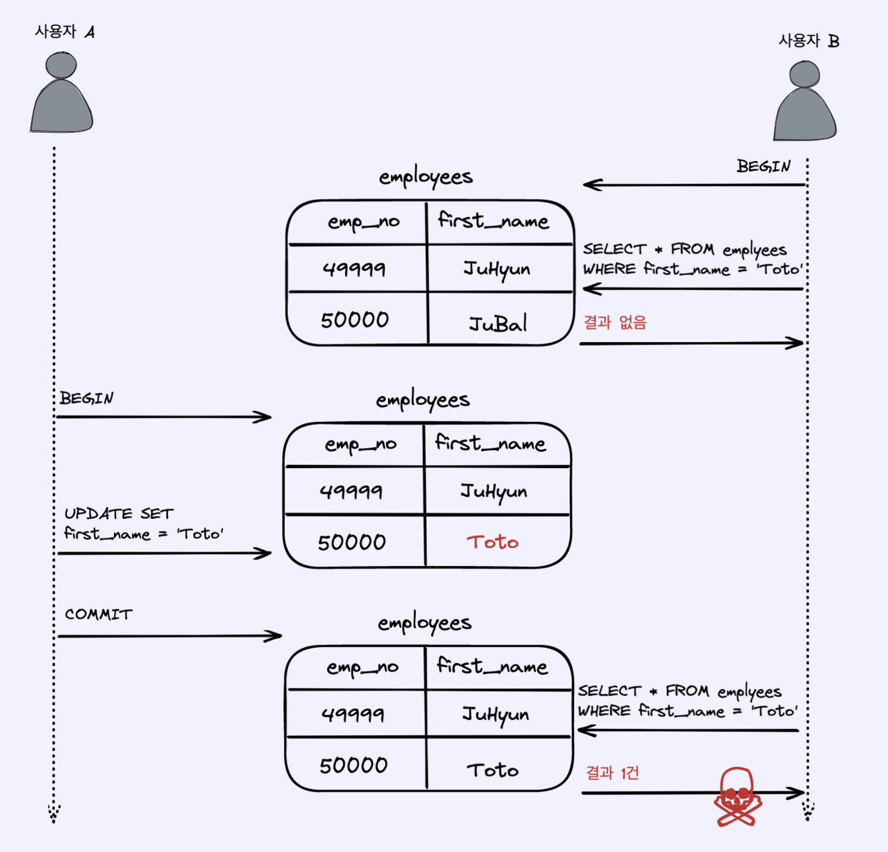

# 영속성 컨텍스트

### 1. 엔티티 매니저 팩토리 & 엔티티 매니저

#### (1) 엔티티 매니저

* 엔티티 매니저는 엔티티를 저장하고, 수정하고, 삭제하고 조회하는 등 엔티티와 관련된 모든 일을 처리한다.
* 개발자 입장에서는 엔티티를 저장하는 가상의 데이터베이스로 생각하면 된다.

#### (2) 엔티티 매니저 팩토리

* 엔티티 매니저 팩토리는 이름 그대로 엔티티 매니저를 만드는 공장인데, 만드는 비용이 상당히 크므로 애플리케이션 전체에서 **1개**만 만들어 공유한다.
* 주의 사항
  * 엔티티 매니저 팩토리는 스레드 안전하지만, 엔티티 매니저는 스레드 안전하지 않다.
  * EntityManager1은 아직 데이터베이스 커넥션을 사용하지 않는데, 엔티티 매니저는 **데이터베이스 연결이 꼭 필요한 시점(트랜잭션)까지 커넥션을 얻지 않는다.**
  * JPA 구현체들은 엔티티 매니저 팩토리를 생성할 때 커넥션 풀도 만든다.

### 2. 영속성 컨텍스트

\<aside> 💡 엔티티를 **영구 저장하는 환경**

\</aside>

* 엔티티 매니저로 엔티티를 저장하거나 조회하면 엔티티 매니저는 영속성 컨테그슽에 엔티티를 보관하고 관리한다.
* em.persist(member)
  * persist() 메소드는 엔티티 매니저를 사용해서 회원 엔티티를 영속성 컨택스트에 저장한다.


* **영속성 컨텍스트는 엔티티 매니저를 생성할 때마다 하나씩 만들어진다.**
* 엔티티 매니저를 통해서 영속성 컨텍스에 접근할 수 있고, 영속성 컨텍스트를 관리할 수 있다.

#### (1) 엔티티의 생명 주기

<figure><figcaption></figcaption></figure>

* 비영속 (new/transient)
  * 영속성 컨텍스트와 전혀 관계가 없는 상태이다.

```java
Member member = new Member();
member.setId("member1");
member.setUsername("회원1");
```


* 영속 (managed)

```java
em.persist(member);
```


* 준영속 (detached)
  * 영속성 컨텍스트에 저장되었다가 분리된 상태이다.
  * 특정 엔티티를 준영속 상태로 만드려면 **em.detach()** 호출
  * \*\*em.close()\*\*를 호출해서 영속성 컨텍스트를 닫음
  * \*\*em.clear()\*\*을 호출해서 영속성 컨텍스트를 초기화
* 삭제 (removed)
  * 말 그대로 삭제된 상태이다. 엔티티를 영속성 컨텍스트와 데이터베이스에서 삭제하면 된다.
  * em.remove(member);

### 3. 영속성 컨텍스트의 특징

#### (1) 1차 캐시


* 영속성 컨텍스트는 내부에 캐시를 가지고 있다. (1차 캐시)
* 영속 상태의 엔티티는 모두 이곳에 저장된다.
* 영속성 컨텍스트 내부에 Map이 하나 있다고 생각하면 된다.
  * Key : **@Id로 매핑한 식별자** (데이터베이스의 기본키)
  * Value : 엔티티 인스턴스
* 영속성 컨텍스트에 데이터를 저장하고 조회하는 **모든 기준은 데이터베이스 기본 키 값**이다.
  * EntityManager.find() 메서드 정의
  * public \<T> T find(Class\<T> entityClass, Object primaryKey);
* 1차 캐시에서의 조회


```java
//1차 캐시에서 조회
Member member = new Member();
member.setId(1L);
member.setName("MemberA");

//1차 캐시에 저장된다.
em.persist(member);
//1차 캐시에서 조회
Member findMember = em.find(Member.class, 1L);
```

* em.find()를 호출하면 우선 1차 캐시에서 식별자 값으로 엔티티를 찾는다.
* 찾는 엔티티가 있으면 데이터베이스를 조회하지 않고 메모리에 있는 1차 캐시에서 엔티티를 조회한다.
*   데이터베이스에서 조회

    
* em.find()를 호출했는데 엔티티가 1차 캐시에 없으면 엔티티 매니저는 데이터베이스를 조회해서 엔티티를 생성한다.
* 1차 캐시에 저장한 후 영속상태의 엔티티를 반환한다.

#### (2) 영속 엔티티의 동일성 보장

```java
//영속 엔티티의 동일성 보장
Member findMember1 = em.find(Member.class, 101L);
Member findMember2 = em.find(Member.class, 101l);
System.out.println(findMember2==findMember1);  //true
```

* em.find()를 반복해서 호출하는 경우 영속성 컨텍스트는 1차 캐시에 있는 같은 엔티티 인스턴스를 반환한다.
* 따라서 둘은 같은 인스턴스 이므로 true이다.
* 영속성 컨텍스트는 엔티티의 동일성을 보장한다.

#### (3) 트랜잭션을 지원하는 쓰기 지연 (Transactional write-behind)

```java
EntityManager em = emf.createEntityManager();
EntityTransaction tx = em.getTransaction();
//엔티티 매니저는 데이터 변경 시 트랜잭션을 시작해야 한다.
tx.begin(); //트랜잭션 시작

Member member1 = new Member(150L, "A");
Member member2 = new Member(160L, "B");

em.persist(member1);
em.persist(member2);
//여기까지 INSERT SQL을 데이터베이스에 보내지 않는다.

tx.commit(); //커밋하는 순간 데이터베이스에 INSERT SQL을 보낸다.
```


* 엔티티 매니저는 트랜잭선을 커밋하기 직전까지 데이터베이스에 엔티티를 저장하지 않고 내부 쓰기 지연 SQL 저장소에 INSERT SQL을 모아둔다.
* 트랜잭션을 커밋하면 엔티티 매니저는 영속성 컨텍스트를 플러시 한다.
  * 플러시는 영속성 컨텍스트의 변경 내용을 데이터베이스에 동기화하는 작업
  * 플러시를 통해 등록, 수정, 삭제한 엔티티를 데이터베이스에 반영한다.

#### (4) 변경 감지 (Dirty Checking)

```java
EntityManager em = emf.createEntityManager();
EntityTransaction tx = em.getTransaction();
tx.begin();

Member member = em.find(Member.class, "memberA");

//영속 엔티티 데이터 수정
member.setName("JPA");

tx.commit();
```

* JPA로 엔티티를 수정할 때는 단순히 엔티티를 조회해서 데이터만 변경하면 된다.


* 트랜잭셕을 커밋하면 엔티티 매니저 내부에서 먼저 플러시가 호출된다.
* 엔티티와 스냅샷을 비교해서 변경된 엔티티를 찾는다.
* 변경된 엔티티가 있으면 수정 쿼리를 생성해서 쓰기 지연 SQL 저장소에 보낸다.
* 쓰기 지연 저장소의 SQL을 데이터베이스에 보낸다.
* 데이터베이스 트랜잭션을 커밋한다.

### 4. 플러시 (Flush)

\<aside> 💡 영속성 컨텍스트의 변경 내용을 **데이터베이스에 반영**한다.

\</aside>

* 영속성 컨텍스트를 비우지 않는다.
* 영속성 컨텍스트의 변경내용과 데이터베이스에 동기화

#### (1) 플러시 실행 시 동작

* 변경 감지가 동작해서 영속성 컨텍스트에 있는 모든 엔티티를 스냅샷과 비교해서 수정된 엔티티를 찾는다.
  * 수정된 엔티티는 수정 쿼리를 만들어 쓰기 지연 SQL 저장소에 등록한다.
* 쓰기 지연 SQL 저장소의 쿼리를 데이터베이스에 전송한다.

#### (2) 영속성 컨텍스트를 플러시하는 방법

* em.flush()
* 트랜잭션 커밋시 플러시 자동 호출
* JPQL 쿼리 실행 시 플러시 자동 호출

### 5. 준영속

\<aside> 💡 영속성 컨텍스트가 관리하는 **영속 상태의 엔티티가 영속성 컨텍스트에서 분리된 것**

\</aside>

#### (1) detach()를 사용한 준영속 상태 전환


* 메소드를 호출하는 순간 1차 캐시부터 쓰기 지연 SQL 저장소까지 해당 엔티티를 관리하기 위한 정보가 삭제된다.


#### (2) clear()를 사용한 영속성 컨텍스트 초기화

* em.clear()는 영속성 컨텍스트를 초기화해서 영속성 컨텍스트의 모든 엔티티를 준영속 상태로 만든다.


#### (3) close()를 사용한 영속성 컨텍스트 종료

* 영속성 컨텍스트를 종료하면 영속 상태의 엔티티가 모두 준영속 상태가 된다.


#### (4) 준영속 상태의 특징

* 거의 비영속 상태에 가깝다.
* 식별자 값을 가지고 있다.
* 지연 로딩을 할 수 없다.
  * 지연 로딩은 실제 객체 대신 프록시 객체를 로딩해 두고, 해당 객체를 실제 사용할 때 영속성 컨텍스트를 통해 데이터를 불러오는 방법

#### (5) merge()를 사용한 병합

* 준영속 상태의 엔티티를 다시 영속 상태로 변경하려면 병합을 사용하면 된다.
